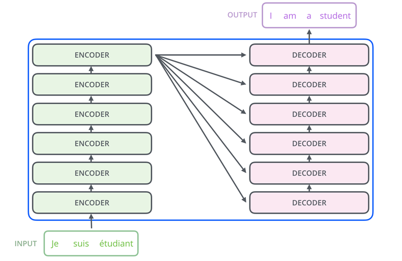

# Machine_Learning_For_NLP
This repository presents my notes for the course 32931 of Prof. Massimo Piccardi.

# Table of Contents

1. [The AI Revolution](#the-ai-revolution)
2. [Main Data Types and Problems in Machine Learning](#main-data-types-and-problems-in-machine-learning)
3. [Choosing, Training, and Testing a Model](#choosing-training-and-testing-a-model)
4. [Main Data Types in NLP](#main-data-types-in-nlp)
5. [Performance Evaluation in NLP](#performance-evaluation-in-nlp)
6. [Deep Learning](#deep-learning)
7. [Transformers, BERT, and GPT](#transformers-bert-and-gpt)

# The AI Revolution
The excitement surrounding artificial intelligence is overwhelming! The launch of generative AI applications like ChatGPT and Stable Diffusion has significantly boosted interest in this technology and its industry. "AI" brings together various disciplines, including machine learning, computer vision, natural language processing, and speech processing, among others. The advancement of AI is closely linked with the evolution of computing and communication technologies, such as GPUs, cloud computing, and edge computing.

**Machine Learning**
Machine learning forms the core basis of all AI algorithms. The subject is vast, and today we can only outline a selection of key ideas. We'll begin with the fundamental principles, followed by their application in natural language processing. Our discussion will end with a summary of deep learning, Transformers, BERT, GPT, and some other modern models.

**Types of data**
Data varies significantly in type, yet essentially falls into two primary categories:
- Numerical: These are measurable quantities that can undergo operations like addition, division, averaging, comparison, etc.
   Examples include age, income, speed, and area.
- Categorical: This type of data signifies "categories" or symbolic values.
   Examples are professions, car models, and words.
Frequently, these data types are merged into composite structures, such as arrays (for example, {age, income, profession}).

# Main Data Types and Problems in Machine Learning

To summarize, machine learning is essentially the method of forecasting numerical or categorical values using a set of other numerical and/or categorical data. The core challenges in this field are identified as:
- Classification: Determining a categorical value from a combination of numerical and categorical data.
- Regression: Estimating a numerical value based on a mix of numerical and categorical inputs.
- Clustering: Organizing numerical data into similar or "homogeneous" groups.

## Classification

 The class represents categorical values, such as "Netflix subscriber." The associated measurements can be diverse, including aspects like age, income, and occupation, and encompass both numerical and categorical data.

## Regression

The ***response*** consists of numerical values, for instance, "holiday expenses." 
The ***measurement***, similar to before, can be varied, such as age, income, and occupation, and include both numerical and categorical types.

Here is the graph illustrating the regression model for predicting a car's mileage per gallon based on its weight and horsepower. The 3D plot shows:
The surface, representing the model's predictions across various combinations of weight and horsepower.
The actual data points are plotted as blue dots, showing how they relate to the model's predictions.
This visualization helps in understanding the relationship between weight, horsepower, and the car's mileage as per the model.

[download code here ](./src/regression.ipynb)

## Clustering

The cluster index resembles a categorical value, such as "cluster 3" or "cluster B," but it initially lacks any intrinsic meaning. Typically, the measurements involved are mulitple and numerical.

[download code here ](./src/clustering.ipynb)

# Choosing, training and testing a model

Faced with a specific issue and a corresponding dataset, selecting an appropriate predictive **model** is crucial. This decision is frequently influenced by the model's known effectiveness, your own past experiences, or a comparative analysis among several viable models. 

Each model comprises adjustable parameters, which are trained using a portion of the dataset. Afterward, you **test** the accuracy of the trained model using the remaining data. If the results are satisfactory, the model is ready for use!

In tasks like **classification** and **regression**, a **supervised** or **annotated** dataset comprising pairs of (measurement, true/desired output) is essential. 
This dataset is crucial for training the model and assessing its accuracy. On the other hand, for clustering, you generally require an unsupervised or unannotated dataset consisting only of measurements.

The evaluation is conducted using only intrinsic measures such as cluster separation and compactness 

## Classification: Popular Algorithms

**Basic**
- Bayesian Classifier
- Logistic Regression Classifier

**Deep Neural Networks**
- Feedforward Neural Networks (FFNNs)
- Convolutional Neural Networks (CNNs)

**Advanced Algorithms**
- XGBoost

**Other Widely Used Methods**
- Support Vector Machine (SVM)
- k Nearest Neighbours (kNN)
- Decision Trees
- Random Forests

# Regression and Clustering: Popular Algorithms

## Regression
- Linear Regression
- Ridge and Lasso Regression
- Gaussian Processes

## Clustering
- k-Means
- Partitioning Around Medoids (PAM)
- Other Female-Named Clustering Algorithms
  - AGNES (AGglomerative NESting)
  - DIANA (DIvisive ANAlysis)
  - DAISY (Distance Analysis SYstem)

# Main data types in NLP
In natural language processing (NLP), the primary data types are words, sentences, and documents. 

**Words:**
- In a selected vocabulary, words are categorized as categorical values and can be identified by their index, ranging from 0 to V-1.
- As inputs, words are commonly transformed into embeddings, typically vectors ranging from 50 to 1024 dimensions.
- Additionally, words are sequences of characters where lexical and morphological characteristics can be utilized, as seen in examples like 'albuterol', 'stylish', and 'predetermined'.

**Sentences:**
- Sentences or paragraphs are often processed as sequences of their constituent words. They also have unique embeddings, such as those created by Sentence-BERT or the Universal Sentence Encoder.

**Documents:**
- Documents are frequently converted into vector representations through various methods:
  - Term frequencies, known as the “bag of words” approach.
  - Term frequency-inverse document frequency (tf-idf).
  - Doc2vec methods.
  - Topic modeling techniques.

# Performance evaluation in NLP
Evaluating performance in NLP tasks presents significantly more challenges compared to typical classification problems. It's hard to establish a universally accepted "ground truth," and quantifying performance levels is complex. There are numerous specialized metrics, some of which rely on **word matching** between your model's output and a human reference (like ROUGE, METEOR, etc.), while others depend on the matching of **word embeddings** (such as BERTScore, BLEURT, etc.).

# Deep learning
Deep learning has become the leading technology in machine learning, not just for natural language processing (NLP) but also in fields like computer vision, signal processing, and data science. This surge in popularity began around 2006, largely due to the groundbreaking work of Geoff Hinton. While deep learning shares similarities with the artificial neural networks of the 1980s and 1990s, it distinguishes itself with significantly increased complexity, a higher number of neurons, and more layers. 

***Deep learning is modular:***

# Typical Layer

A typical layer in a neural network is  similarl to a basic classifier or logistic regressor.

The inputs are scaled by a series of weights (known as parameters), then summed together; this total sum is subsequently passed through a non-linear function, often referred to as a sigmoid.

## Example:

Certainly! Let's consider an example where a neural network neuron is used to predict the likelihood of someone enjoying a movie based on two inputs: the genre of the movie and the duration of the movie.

**Inputs (x):**
   - $$x_1 = $$ Movie genre, coded numerically (e.g., 0 for Action, 1 for Comedy, 2 for Drama, etc.).
   - $$x_2 = $$ Movie duration in hours.

**Weights (w):**
   - $$ w_1 = $$ Weight for movie genre preference. This weight reflects how much the person's enjoyment is influenced by the genre. A higher weight means the genre is very important in deciding whether they'll like the movie.
   - $$ w_2 = $$ Weight for movie duration preference. This weight reflects the person's tolerance for long movies. A negative weight might indicate a preference for shorter movies.

**Bias (b):**
   - A bias term that could represent a person's general disposition towards watching movies, regardless of the genre or duration.

**Activation Function:**
   - We'll use the sigmoid function for the activation.

**Example Scenario:**
   - Suppose our person prefers comedies and shorter movies. We might have: $$x_1 = 1$$ (Comedy), $$x_2 = 1.5$$ hours.
   - We assign weights: $$ w_1 = 0.8 $$ (strong preference for genre), $$ w_2 = -0.5 $$ (dislikes long movies).
   - Let's use a bias of $$ b = 1 $$, assuming the person generally enjoys movies.

**Calculation:**
   - The weighted sum will be: $$ (0.8 \times 1) + (-0.5 \times 1.5) + 1 = 0.8 - 0.75 + 1 = 1.05 $$.
   - Applying the sigmoid function: $$ \sigma(1.05) = \frac{1}{1 + e^{-1.05}} \approx 0.74 $$.
   
In this example, the neuron's output is approximately 0.74, indicating a fairly high likelihood of the person enjoying the comedy movie that lasts 1.5 hours. The genre (comedy) positively influences the prediction, while the duration has a slight negative impact, reflected in the weights and the final output.

# Backpropagation
Backpropagation, short for "backward propagation of errors," is a method used for fine-tuning the weights of a neural network based on the error rate (loss) obtained in the previous epoch (i.e., iteration). Proper adjustment of weights allows the model to learn from its errors and improve over time. Here's how backpropagation works:

1. **Forward Pass**:
   - **Input**: The process begins with passing the input data through the neural network.
   - **Layer-by-Layer Processing**: Each layer in the network processes the input and passes it to the next layer.
   - **Output**: The final layer produces an output, which is the network's prediction.

2. **Loss Calculation**:
   - The output of the network is compared to the true value or label to calculate the error or loss, typically using a loss function like mean squared error for regression tasks or cross-entropy for classification tasks.

3. **Backward Pass (Backpropagation)**:
   - **Error Attribution**: Backpropagation starts at the output and moves backward through the network layers, attributing a portion of the error to each parameter (weight and bias).
   - **Gradient Calculation**: It calculates the gradient of the loss function with respect to each weight in the network by applying the chain rule of calculus. This gradient tells us how much the loss will change if the weight is increased or decreased.
   - **Gradient Descent**: Using these gradients, the algorithm adjusts the weights in a direction that minimizes the loss. The size of the adjustment is governed by a parameter called the learning rate.

4. **Iterative Optimization**:
   - The entire process is repeated for many epochs, or iterations, with the input data being passed forward and errors being propagated backward each time.
   - With each iteration, the weights are incrementally adjusted, and the network's predictions should become more accurate, reducing the overall loss.

Backpropagation is essentially a way for the neural network to learn from its mistakes. By understanding which weights contribute to higher error rates and adjusting them accordingly, the network becomes increasingly better at making predictions. The efficiency and effectiveness of backpropagation have made it a cornerstone algorithm in deep learning for training various types of neural networks.

# Automatic differentiation

In neural networks, the derivative (or gradient) is crucial because it indicates how much a change in the weights and biases will affect the overall loss or error of the model. Essentially, the derivative provides guidance on how to adjust these parameters to minimize the loss. By knowing the direction and magnitude of the required change (which the derivative informs), the learning algorithm (typically gradient descent) can iteratively adjust the weights in a way that steadily reduces the error. This process is key to the network's ability to learn from data and improve its predictions. Automatic differentiation (autodiff) simplifies this process by automating the computation of these derivatives, which are essential for the backpropagation algorithm used to train neural networks.

Popular libraries include **PyTorch, TensorFlow, JAX**

# Preamble: main types of NLP tasks 
NLP encompasses a wide range of tasks, yet when considering the perspective of machine learning technology, the primary categories are:

## Seq2seq
A seq2seq model is composed of two parts: an encoder, which converts the input sentence into internal representations, and a decoder, which produces the output sentence word by word. This model allows for the input and output sentences to naturally vary in length.

***courtesy of Dive into Deep Learning, https://d2l.ai/***

# Language models
In predictive terms, a "language model" (LM) is akin to a classifier designed to predict words. 

More comprehensively, it's a model that assigns probabilities to sequences of words, favoring grammatically correct and contextually coherent sentences in a given language and assigning lower probabilities to incorrect or less likely sequences.

**Why are language models such precious resources, in general?**
Language models are invaluable assets because they are capable of being taught from vast volumes of text data through self-supervision, eliminating the need for laborious manual labeling. Through this process, they acquire robust and insightful vector representations of their inputs. For task-specific applications, often only the final layer, or "head," of these models requires adjustments or fine-tuning. For instance, with "prompt"-based language models like ChatGPT or Claude, even this step is unnecessary; they can be guided effectively using well-crafted prompts. For example, ChatGPT can generate articles, answer questions, or compose poetry based on the prompts it receives.

## The Transformer 
The **Transformer**, introduced by Ashish Vaswani and colleagues from Google Brain in 2017, is a groundbreaking sequence-to-sequence architecture. The Transformer is a neural network architecture that relies on a mechanism called attention, eschewing the recurrence and convolutions typically used in sequence modeling. It encodes input data through a stack of self-attention layers in the encoder, allowing the model to weigh the importance of different parts of the input. The decoder similarly uses self-attention to generate outputs sequentially. Cross-attention layers in the decoder help focus on relevant parts of the input sequence. This architecture enables parallel processing of sequences, greatly speeding up training. Transformers have become the foundation for many state-of-the-art NLP models due to their effectiveness in handling long-range dependencies.

It features multiple encoder and decoder layers stacked in succession.

***courtesy of the fantastic Jay Alammar***

For a deep dive into Transformers is available here :https://github.com/amgi22/Transformers

**Main uses of the transformer**

- Seq2seq NLP tasks: Utilize the full Transformer structure (both encoder and decoder), seen in models like BART from Meta and T5 from Google.
- Text classification and sequence tagging: Only the Transformer's encoder is necessary, with an added specific "head," such as BERT employs.
- "Prompt"-based models: Primarily deploy the decoder portion, as with ChatGPT, which starts the generation process based on manually provided initial tokens (the "prompt").

### BERT

BERT, which stands for Bidirectional Encoder Representations from Transformers, functions by processing input data in two ways: It analyzes each word in the context of all the other words in a sentence, rather than in isolation or in a left-to-right order. This is achieved through a mechanism known as the attention mechanism, which weighs the influence of different words within the sentence.

Here's a simplified explanation of how BERT works:

**Input Representation**: BERT takes a sentence where some words or tokens are masked randomly and creates an input representation that combines the embeddings of the words, their segment, and their position within the sentence.

**Pre-training**: BERT is pre-trained on a large corpus of text using two tasks: masked language modeling (where it predicts the masked words) and next sentence prediction (where it predicts if one sentence logically follows another).

**Fine-tuning**: After pre-training, BERT can be fine-tuned with additional output layers for a wide array of specific tasks like question answering, sentiment analysis, and more. During fine-tuning, BERT adjusts its weights to better perform the specific task at hand, using both its pre-trained context understanding and the specifics of the new task.

**Bidirectional Context**: BERT's bidirectional nature allows it to understand the context of a word based on all of its surroundings (left and right of the word), which was a significant shift from previous models that looked at words sequentially.

This powerful ability to understand the nuances and context of language has made BERT one of the most influential models in NLP, leading to improved performance across many language understanding tasks.

***courtesy of Jay Alammar https://jalammar.github.io/illustrated-bert/***

### GPT (Generative Pre-trained Transformer)
GPT*, a family of **language models** developed by OpenAI, is designed for a wide array of NLP tasks. Since its first release to the public in 2020, GPT has garnered significant media attention, sparking reactions of awe, skepticism, and debate. In February 2023, ChatGPT achieved a milestone, becoming the fastest-growing consumer application in history.

GPT functions as a network exclusively using decoders. It operates by being "prompted" with an initial few words, from which it then generates the subsequent output. The variety of prompts given to GPT can steer it towards a range of tasks, including storytelling, machine translation, summarization, question answering, code generation, among others, with each different prompt guiding the model towards a specific output or task.

Among other, ChatGPT can perform a range of impressive tasks, including:

**Conversational AI**: Engaging in coherent and context-aware conversations on a wide range of topics.
**Text Generation**: Creating well-written and coherent long-form content like stories, essays, or reports.
**Language Translation**: Translating text between various languages while maintaining the context and nuances.
**Question Answering**: Providing accurate answers to questions across different domains.
**Summarization**: Condensing lengthy documents into concise summaries without losing key information.
**Code Generation and Debugging**: Writing and debugging simple code snippets in various programming languages.
**Creative Writing**: Composing poetry, scripts, and creative stories.

#### Using prompt-based models
You have the option to pose a direct question ("zero-shot") or precede it with one or more examples. Additionally, you can offer a sequence of guiding steps ("chain-of-thought", CoT). This approach was exemplified by Suzgun et al. in their ACL (Findings) 2023 paper, where they applied it to another prompt-based model, Google's PALM.

#### ChatGPT's NLP performance
ChatGPT's performance in comparison to traditional NLP models has been quantitatively assessed. In a study by Laskar et al., presented in ACL (Findings) 2023, the model was evaluated across 140 tasks with a dataset of 255K outputs. According to the paper, while ChatGPT demonstrates a broad task range and impressive results on several benchmarks, it has not yet reached a level of consistent reliability in solving many complex tasks. This research offers a detailed and current analysis of the model's capabilities.

### A panoramic of other LLMs
Models currently leading in NLP accuracy, like BERT, BART, and T5, are tailored for particular tasks using specific training datasets. They range from 100 million to 10 billion parameters, considered small by today's standards. Competing prompt-based models include Google's LaMDA, PaLM, and PaLM 2, as well as Meta's LLaMA, some of which are instruction-tuned using specialized prompts. For a wealth of resources, the Hugging Face repository https://huggingface.co/  is highly recommended. The field of NLP is advancing rapidly.

### Med-PaLM
The study titled "Large language models encode clinical knowledge," released on July 12 in Nature, evaluated Med-PaLM, a specialized version of PaLM, examining its grasp of clinical knowledge, factual accuracy, comprehension, reasoning, potential harm, and bias across six medical question-answering datasets.

 Key findings include ongoing trials of Med-PaLM 2 at the Mayo Clinic.

 ### Size/number of parameters

 Google Brain pioneered the development of a model surpassing the trillion-parameter mark with the Switch Transformer, which possesses 1.6 trillion parameters, released in January 2021. Comparatively, the average human brain contains about 86 billion neurons, as reported by Wikipedia. Beniaguev and colleagues in a 2021 Neuron publication posited that one human neuron might be analogous to around 1,000 artificial neurons. This raises the question of whether neural networks will imminently match the human brain's capacity in terms of raw computational power.

 ## References 
- Christopher M. Bishop, Pattern recognition and machine learning, 5th Edition, Information science and statistics, Springer 2007, ISBN 9780387310732, pp. I-XX, 1-738
- Quoc V. Le, Tomas Mikolov, Distributed Representations of Sentences and Documents, ICML 2014: 1188-1196 (doc2vec)
- Daniel Cer, Yinfei Yang, Sheng-yi Kong, Nan Hua, Nicole Limtiaco, Rhomni St. John, Noah Constant, Mario Guajardo-Cespedes, Steve Yuan, Chris Tar, Yun-Hsuan Sung, Brian Strope, Ray Kurzweil, Universal Sentence Encoder. CoRR abs/1803.11175 (2018)
- Kishore Papineni, Salim Roukos, Todd Ward, Wei-Jing Zhu, Bleu: a Method for Automatic Evaluation of Machine Translation, ACL 2002: 311-318
- Guillaume Klein, Yoon Kim, Yuntian Deng, Jean Senellart, Alexander M. Rush: OpenNMT: Open-Source Toolkit for Neural Machine Translation. ACL (System Demonstrations) 2017: 67-72
- A. Vaswani, N. Shazeer, N. Parmar, J. Uszkoreit, L. Jones, A. N. Gomez, L. Kaiser, Il. Polosukhin, Attention Is All You Need, NIPS 2017 (the Transformer paper)
- J. Devlin, M.-W. Chang, K. Lee, K. Toutanova, BERT: Pre-training of Deep Bidirectional Transformers for Language Understanding, NAACL-HLT 2019
- C. Raffel and 8 other authors: Exploring the Limits of Transfer Learning with a Unified Text-to-Text Transformer. J. Mach. Learn. Res. 21: 140:1-140:67 (2020) (the T5 paper)
- T. Brown and 30 other authors, Language Models are Few-Shot Learners, NeurIPS 2020 (the GPT-3 paper)
